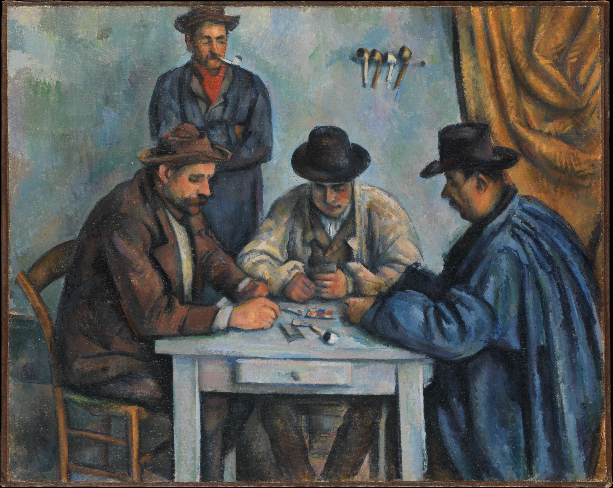

# Simulating Blackjack


## Code Source: **Nolan and Lang**, _Case Studies in Data Science with R_

```{r setup, include=FALSE}
knitr::opts_chunk$set(   # This is for later! Don't worry about it now. 
  echo = TRUE,           # Don't show code.
  warning = FALSE,       # Don't show warnings.
  message = FALSE,       # Don't show messages (less serious warnings).
  cache = FALSE,         # Set to TRUE to save results from last compilation.
  fig.align = "center"   # Center figures.
)
library(tidyverse)       # Load libraries you always use here.
library(tidymodels)
library(ggplot2)
library(knitr)
library(kableExtra)
library(latex2exp)
#library(fixltx2e)
library(ggridges); library(reshape2)
library(mosaic)

set.seed(18) 
```

\begincols
\begincol{.5\textwidth}


\endcol
\begincol{.5\textwidth}


\endcol
\endcols

```{r echo=FALSE, out.width='48%', fig.cap="\\textit{The Card Players}, \\textbf{Paul Cézanne}, 1890-1892, Metropolitan Museum of Art"}

```

## What is Blackjack? 

* Card game, goal: sum cards as close to 21 without going over
* A few nuances to card value (e.g., Ace can be 1 or 11)
* Start with 2 cards, build up one card at a time
* Lots of different strategies (also based on dealer’s cards)


## Establish Deck and Shuffling

```{r}
deck = rep(c(1:10, 10, 10, 10), 4)

shuffle_decks = function(n) sample(rep(deck, n))
```


## Given Hand, Calculate Value

```{r}
handValue = function(cards) {
  value = sum(cards)
       # Check for an Ace and change value if it doesn't bust
  if (any(cards == 1) && value <= 11) 
    value = value + 10
       # Check bust (set to 0); check black jack (set to 21.5)
  if(value > 21) 
    return(0) 
  else if (value == 21 && length(cards) == 2)  
    return(21.5) # Blackjack
  else 
    return(value)
}

```

## Testing `handValue`

```{r}
handValue(c(10,4))
handValue(c(10, 1))
handValue(c(10,10))
```

## Better Test of `handValue`
```{r}
test_cards = list( c(10, 1), c(10, 5, 6), c(10, 1, 1), 
                   c(7, 6, 1, 5), c(3, 6, 1, 1), 
                   c(2, 3, 4, 10), c(5, 1, 9, 1, 1),
                   c(5, 10, 7), c(10, 9, 1, 1, 1)) 

test_cards_val = c(21.5, 21, 12, 19, 21, 19, 17, 0, 0)
sapply(test_cards, handValue)  # apply the function handValue to test_cards
identical(test_cards_val, sapply(test_cards, handValue))

```


## Explicit Outcome Evaluation (Outputs Multiplier of Wager)

```{r}
winnings = function(dealer, players) {
  if (dealer > 21) {  # Dealer=Blackjack, ties players with Blackjack
    -1 * (players <= 21)
  } else if (dealer == 0) { # Dealer busts - all non-busted players win
    1.5 * (players > 21) +
      1 * (players <= 21 & players > 0) +
     -1 * (players == 0) 
  } else {            # Dealer 21 or below, all players > dealer win
    1.5 * (players > 21) +  
      1 * (players <= 21 & players > dealer) +
     -1 * (players <= 21 & players < dealer) 
  }
}


```
## Testing `winnings` v1

```{r}
winnings(17,c(20, 21.5, 14, 0, 21))

```


## More Compact Outcome Evaluation (Outputs Multiplier of Wager)
```{r}
winnings = function(dealer, players){
  (players > dealer & players > 21) * 1.5 + # Blackjack
  (players > dealer & players <= 21) * 1 +  # win
  (players < dealer | players == 0) * -1    # lose
}

winnings(17,c(20, 21.5, 14, 0, 21))

```

## Testing `winnings`

```{r}
test_vals = c(0, 16, 19, 20, 21, 21.5)

testWinnings =
  matrix(c( -1,  1,  1,  1,  1, 1.5,
            -1,  0,  1,  1,  1, 1.5,
            -1, -1,  0,  1,  1, 1.5,
            -1, -1, -1,  0,  1, 1.5,
            -1, -1, -1, -1,  0, 1.5,
            -1, -1, -1, -1, -1, 0), 
         nrow = length(test_vals), byrow = TRUE)
dimnames(testWinnings) = list(dealer = test_vals, player = test_vals)
```

## Testing `winnings`

```{r}
testWinnings
```

## Testing `winnings`

```{r}
check = testWinnings  # make the matrix the right size
check[] = NA  # make all entries NA
 
for(i in seq_along(test_vals)) {
  for(j in seq_along(test_vals)) {
    check[i, j] = winnings(test_vals[i], test_vals[j])
  }
}

identical(check, testWinnings)

```


## Function for Getting More Cards
```{r}
shoe = function(m = 1) sample(deck, m, replace = TRUE)
  # Shoe is where the deck or decks are held

new_hand = function(shoe, cards = shoe(2), bet = 1) {
  list(bet = bet, shoe = shoe, cards = cards)
}
```

## Example Usage of Function

```{r}
myCards = new_hand(shoe, bet = 7)
myCards

```

## Actions with effects: #1: `hit`

Receive another card

```{r}
hit = function(hand) {
  hand$cards = c(hand$cards, hand$shoe(1))
  hand
}

hit(myCards)$cards

```


## Actions with effects: `stand`

Stay with current cards

```{r}
stand = function(hand) hand

stand(myCards)$cards

```


## Actions with effects: `double down (dd)`

Double the bet after receiving exactly one more card

```{r}
dd =  function(hand) {
  hand$bet = hand$bet * 2
  hand = hit(hand)
  stand(hand)
}

dd(myCards)$cards
```

## Actions with effects: `split a pair`

Create two different hands from initial hand with two cards of the same value

```{r}
splitPair = function(hand) {
  list( new_hand(hand$shoe, 
             cards = c(hand$cards[1], hand$shoe(1)),
             bet = hand$bet),
        new_hand(hand$shoe, 
             cards = c(hand$cards[2], hand$shoe(1)),
             bet = hand$bet))   
}

```

## Split Result

```{r}
splitHand = splitPair(myCards)
splitHand[[1]]$cards
splitHand[[2]]$cards
```


## Example of Play

```{r}
set.seed(470)
dealer = new_hand(shoe)
player = new_hand(shoe)
dealer$cards

```

## Example of Play
```{r}
player$cards; player = hit(player); player$cards
dealer$cards; dealer = hit(dealer); dealer$cards
```


## Who wins?

```{r}
dealer$cards; player$cards
handValue(dealer$cards); handValue(player$cards)
winnings(handValue(dealer$cards), handValue(player$cards))
```

## Simple Strategy

```{r}
strategy_simple = function(mine, dealerFaceUp) {
  if (handValue(dealerFaceUp) > 6 && handValue(mine) < 17) 
     "H" 
  else 
     "S"
}

```


## Improved Simple Strategy

```{r}
strategy_simple = function(mine, dealerFaceUp) {
  if (handValue(mine) == 0) return("S")
  if (handValue(dealerFaceUp) > 6 && handValue(mine) < 17) 
     "H" 
  else 
     "S"
}

```

## Dealer

Dealer needs to achieve at least a 17 no matter what

```{r}
dealer_cards = function(shoe) {
  cards = shoe(2)
  while(handValue(cards) < 17 && handValue(cards) > 0) {
    cards = c(cards, shoe(1))
  }
  cards
}

dealer_cards(shoe)

```

## Playing a Full Hand

```{r}
play_hand = function(shoe, strategy, 
      hand = new_hand(shoe), dealer = dealer_cards(shoe)) {
  face_up_card = dealer[1]
  action = strategy(hand$cards, face_up_card)
  while(action != "S" && handValue(hand$cards) != 0) {
    if (action == "H") {
      hand = hit(hand)
      action = strategy(hand$cards, face_up_card)
    } else {
      stop("Unknown action: should be one of S, H")
    }
  }  
  winnings(handValue(dealer), handValue(hand$cards)) * hand$bet
}

```


## Play a Few Hands


```{r}
play_hand(shoe, strategy_simple)
play_hand(shoe, strategy_simple, new_hand(shoe, bet=7))

```

## Repeated Games

```{r}
reps=5
money=20
for(i in 1:reps){
  money <- money + play_hand(shoe, strategy_simple)
  print(money)}

```


# Qwixx Program Tasks

## Reminder

At this point, you should have read **Hands on Programming with `R`**, which discusses three _programming of games projects_. I suggest you read as much of this as you can if you haven't already (it's a surprisingly fast read!). You've [all programmed in Java or C](https://www.amherst.edu/academiclife/departments/courses/1920S/COSC/COSC-111-1920S), and you've all worked with `R` in [STAT231: Data Science](https://www.amherst.edu/academiclife/departments/courses/2021F/STAT/STAT-231-2021F). This book neatly wraps up programming with `R` (to the extent you should need it for the mini-project). You may feel inclined to skip to Ch 5 and 6 for a quick skim/refresh, and then **carefully read and work through Ch 7-11**. I'd suggest reading this over the next couple of days and incorporating it into your Qwixx program. 

## Lab/HW Overview

\begincols
\begincol{.45\textwidth}

* Your overall objective is to write a program in `R` which is a collection of functions that simulates a single, 2-player game of Qwixx.

* Refer to the Qwixx rules early and often to make sure your game is being played correctly.

* As a placeholder, you will program a default strategy that I'll describe below. Do not submit your group's personal/actual strategy.


\endcol
\begincol{.55\textwidth}

* As with any program, you should break each part into small, repeatable steps, i.e., functions.

* To make your strategy/game compatible with other strategies, I will be sharing the best programmed game simulation after Monday, after which you will build your strategy in reference to the schemas/functions/etc established in that program.

* We'll also be discussing decision analysis next, and I want you to incorporate that into your strategy. (i.e., hold off on your personal strategies for the moment!)

\endcol
\endcols


## Complete at Least the Following During Lab


* Write an `R` function for a single die roll

* Write an `R` function which takes on five arguments, `blue`, `green`, `red`, `yellow`, `print`, which default to `TRUE` (4x) and `FALSE`, that simulates a Qwixx dice roll. The purpose of the first four `TRUE`/`FALSE` inputs is to determine whether to roll a certain color of die (i.e., you may not roll green because it's locked out, and so you output 0 for the green roll.)

## More HW Tips/Instructions


\begincols
\begincol{.5\textwidth}

* Don't use global scope -- game states should be passed from function to function.

* Include a `playRound` function that takes in both game boards, an indicator for which player is the active player, and a strategy for each person.
 
* The strategy should not be directly tied to `playRound` function, and should take ANY strategy that produces legal moves (i.e., two dice/ one die/zero dice + penalty placed by the active player, one die/zero dice placed by the passive player).

\endcol
\begincol{.5\textwidth}

* Include a function that checks whether a move is legal given a board state, locked row indicators, whether someone is active roller or passive roller, and if someone is active roller, whether the secret dice move can be played AFTER the public dice move.
 
* All of your code should be in a single `R` script and should be call-able by a single function which takes on player 1 strategy and player 2 strategy and outputs, at minimum, a vector with player 1 and player 2 scores as well as the final game board for both players).


\endcol
\endcols

 


## Default strategy (very beatable!)

* Should default to "penalty" only if there is no possible move.
* Should pick a single move that places an `x` in the leftmost box. If there's a tie, draw the color at random.
* Should never put two `x`s down on the same roll.
* Should only place an `x` while they're the active roller.


